 # Aventur Social Media Brand & Marketing Guide
*Last Updated: June 24, 2026 

This Brand & Marketing Guide is a strategic handbook for promoting and scaling **Aventur** (the AI Vacation Concierge) across social media networks. It details the visual guidelines, verbal tone, platform-specific strategies, copy libraries, and AI prompting blueprints required to create cohesive, premium, and high-converting marketing content.
---

## Table of Contents
1. [Brand Positioni g & Core Value Propositions](#1-brand-positioning--core-value-propositions)
2. [Social Media Voice, Tone, & Persona](#2-social-media-voice-tone--persona)
3. [The Four Core Content Pillars](#3-the-four-core-content-pillars)
4. [Visual Identity & Styling Rules](#4-visual-identity--styling-rules)
5. [AI Image Gener tion Prompting Handbook (Midjourney & Gemini)](#5-ai-image-generation-prompting-handbook-midjourney--gemini)
6. [Platform-Spe cific Copy Sheets & Video Scripts](#6-platform-specific-copy-sheets--video-scripts)
7. [The 3-Phase Social Launch Campaign Blueprint](#7-the-3-phase-social-launch-campaign-blueprint)
 
---

## 1. Brand Positioning & Core Value Propositions 
Aventur is positioned as a **premium, stress-free, and intelligent travel companion** that replaces the chaotic noise of modern trip planning with a single, elegant digital workspace.

### Target Audience 
- **The Burned-Out Planner:** Busy professionals or couples who spend hours browsing travel blogs, coordinates, forums, and hotel comparison sites only to feel overwhelmed.
- **The Value Seeker:** Smart travelers looking to optimize pricing, shoulder-season windows, and flights without sacrificing quality.
- **The Experience Advent urer:** Travelers seeking authentic, certified local guides and curated local paths rather than cookie-cutter tourist traps.

### Core Value Propositions (The Hook Matrix)
- **30-Second Matching:** Compiles origin coordinates, day counts, and interests to formulate matching destinations and daily itineraries instantly.
- **Dynamic Smart Pricing:** Shows pricing indicators for flights and lodges (Budget, Midrange, Luxury) to avoid checkout shock.
- **Vetted Local Experts:** Direct links to certified local guides in target cities (Kyoto, Rome, Paris, Petra) to bypass tourist traps.
- **Offline Private Diary:** A secure travel journal that preserves planned itineraries, notes, and reservation files offline in browser local IndexedDB.

---

## 2. Social Media Voice, Tone, & Persona

The Aventur social persona acts as **The Curator & The Wise Companion**. We do not scream for attention with generic, emoji-stuffed clickbait. We write with quiet confidence, inspiring travelers while reassuring them with structure.

### Voice Attributes
- **Inspirational:** Focuses on the beauty of global travel (wanderlust) and the relief of letting go of trip stress.
- **Reassuring:** Uses precise terminology, structural confidence, and security metrics (offline first, private storage).
- **Clever & Concise:** Short hooks, bulleted benefits, and clear, active verbs.

### Do's & Don'ts Checklist

| DO | DON'T |
| :--- | :--- |
| **Do** frame AI as a helpful concierge that structures travel variables. | **Don't** sound overly technical or use complex programming jargon (e.g., "LLMs", "tokens"). |
| **Do** highlight concrete metrics like "Planned in 30 seconds" or "Saved $600". | **Don't** make vague claims (e.g., "The best app ever for planning holidays"). |
| **Do** write elegant, clean captions with structured lists. | **Don't** use blocks of unspaced text or over-clutter captions with emojis. |
| **Do** connect travel scenery to human feelings (relief, focus, discovery). | **Don't** focus solely on software screens; focus on the *lifestyle* the app enables. |

---

## 3. The Four Core Content Pillars

Every piece of content posted on Instagram, LinkedIn, TikTok, or X should align with one of these four pillars.

### Pillar 1: Time is Luxury (Curation & Tech)
- **Goal:** Showcase the speed and convenience of the AI concierge.
- **Concept:** Compare the weeks of research required for manual planning with a 30-second Aventur generation.
- **Visuals:** Speed-ramped screen captures of the questionnaire form turning into a completed itinerary, juxtaposed with aesthetic travel overlays.

### Pillar 2: Curated Wanderlust (Visual Storytelling)
- **Goal:** Fuel the desire to travel and showcase Aventur's curated database.
- **Concept:** Highlight handpicked destinations (e.g., Kyoto bamboo temples, Petra sandstone gorges, Santorini sunsets) alongside the specific Aventur-vetted local tips for that region.
- **Visuals:** High-contrast, cinematic travel reels and carousel photos.

### Pillar 3: Shoulder-Season Smart Pricing (Budget Optimization)
- **Goal:** Establish Aventur as a tool for financial intelligence in travel.
- **Concept:** Share money-saving travel hacks using Aventur's budget indicator, showing how booking shoulder-season months dramatically reduces costs.
- **Visuals:** Clean infographics, cost tables, and comparative rate highlights.

### Pillar 4: Safe Passage (Local Guides & Offline Security)
- **Goal:** Build trust and emphasize security.
- **Concept:** Focus on the safety of vetted local guides and the security of having your itinerary, booking references, and notes saved offline in your browser's private diary.
- **Visuals:** Warm photos of guides with travelers, combined with secure, lock-icon graphic overlays.

---

## 4. Visual Identity & Styling Rules

To stand out on social feeds, Aventur templates use a **Modern Glassmorphic** style. It combines deep slate elements, clean white layers, and soft glowing gradients.

### Color Palette

> [!TIP]
> Click on the color swatches below to view their details. Use these exact color codes when building marketing templates in Canva or Figma.

- **Primary Brand Blue:** `#2563eb` (Tailwind `bg-blue-600`) — Represents security, blue skies, and horizons.
- **Deep Navy:** `#0f172a` (Tailwind `bg-slate-900`) — Used for high-contrast dark theme backdrops and text headers.
- **Washed Horizon Slate:** `#f8fafc` (Tailwind `bg-slate-50`) — Used for clean, bright light-theme backgrounds.
- **Vetted Emerald:** `#10b981` (Tailwind `bg-emerald-500`) — Represents certification, green lights, and safety.
- **Warning Gold:** `#f59e0b` (Tailwind `bg-amber-500`) — Used to highlight price reductions and shoulder-season warnings.

### Typography (Social Template Pairings)
- **Primary Header Font:** **Plus Jakarta Sans** (Bold/Extra Bold) — Used for hook texts, quotes, and title overlays.
- **Body Font:** **Inter** (Regular/Medium) — Used for description captions, metrics, and smaller text layers.
- **Metric Font:** **JetBrains Mono** — Used for price points (`$$$`), durations (`30s`), and dates to evoke precise calculation.

### Graphic Composition Guidelines
1. **Glassmorphism Layers:** Always place text overlay boxes over busy travel images. Use a white container with `backdrop-filter: blur(12px)` and a subtle `border: 1px solid rgba(255, 255, 255, 0.1)`.
2. **Gradient Accents:** Use subtle background gradients shifting from Deep Navy `#0f172a` to Blue-Gray `#1e3a8a` to frame mobile mockups.
3. **No Visual Noise:** Keep templates clean. Maintain a 30% negative space rule so the travel photography remains the main focus.

---

## 5. AI Image Generation Prompting Handbook (Midjourney & Gemini)

Use these pre-crafted, premium prompts to generate stunning on-brand social media assets.

### 1. The Hero Lifestyle Graphic (Instagram Grid/Pins)
> **Prompt:** A professional split-screen comparison graphic. Left side: a phone displaying a generic chaotic travel spreadsheet with warning symbols, clinical white studio lighting, cold colors. Right side: A close-up of a traveler's hand holding a modern smartphone showing the Aventur app itinerary in Kyoto; the background shows a blurry, warm, sunlit bamboo forest in Arashiyama, golden hour lighting, cinematic, photorealistic, 8k resolution, Hasselblad lens photography. --ar 4:5 --stylize 250

### 2. Destination Wanderlust Lookbook (Pinterest/Instagram Carousel)
> **Prompt:** Cinematic travel photograph of Petra, Jordan. View through the narrow sandstone Siq canyon looking at the carved Treasury building, soft golden morning light, warm orange and pink hues, realistic dust particles caught in sunbeams, premium travel publication style, highly detailed textures, Leica M11 --ar 4:5 --v 6.0

### 3. User Mockup Backdrop (Ad Creatives/Stories)
> **Prompt:** A sleek modern laptop and a cup of matcha green tea on a clean, light oak table next to a large window in a Scandinavian-style cafe. Soft natural morning light, clean shadows. On the laptop screen, a high-fidelity travel itinerary dashboard with map nodes. Glassmorphism UI elements, minimalist aesthetic, warm tones, architectural digest photography --ar 9:16 --style raw

---

## 6. Platform-Specific Copy Sheets & Video Scripts

### Channel 1: Instagram & Threads (Aesthetic & Value)
- **Layout:** High-quality carousel or reel showing travel scenery -> transitioning to the Aventur planning screen -> closing with a clean CTA.
- **Caption Template:**
```markdown
You don't need another 15-tab spreadsheet. You just need 30 seconds. 

Planning a getaway often takes longer than the trip itself. Endless reviews, fluctuating prices, and unvetted tours turn vacation dreaming into work. 

Aventur changes that. Our AI Vacation Concierge processes your origin, budget, and interest profiles to craft the perfect escape coordinates:

✦ Custom day-by-day itineraries mapped in 30 seconds
✦ Dynamic cost indicators for flights and hotels
✦ Certified local guides linked directly to your route
✦ Offline-first journal that keeps your plans private

Stop searching. Start exploring. Link in bio to plan your first escape free. 🗺️

#AventurTravel #AITravelPlanner #TravelSmart #Wanderlust #StressFreeTravel #KyotoConcierge
```

---

### Channel 2: LinkedIn (Productivity & Tech Innovation)
- **Layout:** High-fidelity mockup graphic of the Aventur dashboard with clean layout annotations.
- **Post Copy:**
```markdown
Travel planning is broken. The average traveler visits 38 websites before booking a single trip. 

As professionals, our time is our most valuable asset. Spending weekends compiling chaotic flight options and fragmented hotel suggestions isn't planning—it's database management. 

That is why we built Aventur. 

Aventur treats travel coordinates like a multi-variable optimization problem, combining destination search, budget forecasts, and day-by-day schedules into a single, cohesive canvas:

1. **Structured Variables:** Input budget limits, companions, and interests. Get curated matches.
2. **Financial Forecasts:** Native flight indicators and lodging tiers prevent checkout shock.
3. **Local Handshakes:** Skip generic tourism agencies. Access certified local guides on-demand.
4. **Data Privacy:** Itineraries and notes sync reactively but remain securely stored offline in your browser's private journal.

Technology should give you your time back. Try planning your next trip in 30 seconds: [Link]

#Productivity #AITravel #ProductDesign #IndieHackers #TravelTech #UXDesign
```

---

### Channel 3: TikTok & Instagram Reels (Short-Form Video Script)
- **Hook Strategy:** Visual pattern interrupt. Start with a chaotic, fast-paced action (e.g., slamming a laptop shut in frustration).
- **Video Style:** POV creator style with fast screen overlays.

#### 🎥 Video Script: "The 30-Second Kyoto Honeymoon" (9:16 Format)

| Visual / Action | Text Overlay (On Screen) | Audio / Voiceover |
| :--- | :--- | :--- |
| **0:00 - 0:03**<br>Creator slams laptop shut, rubbing forehead in stress. Close up on tired face. | "Me trying to plan a 7-day Kyoto trip..." | "I was literally about to cancel our trip. Trying to plan Kyoto was taking weeks." |
| **0:03 - 0:08**<br>Quick screen transition showing the Aventur mobile interface. Creator clicks "Let AI Match" and sets budget to Midrange. | "Enter Aventur: The AI Concierge" | "Then I found Aventur. You just input your budget, origin, and interests..." |
| **0:08 - 0:15**<br>Fast speed-ramp showing the daily itinerary generation. Focus on morning/afternoon blocks. | "Planned in 30 seconds flat 🤯" | "...and it builds your entire day-by-day itinerary in like 30 seconds. Look at this." |
| **0:15 - 0:20**<br>Quick cuts of beautiful travel footage (Ryokan in Gion, tea house). Show the vetted guide contact. | "Ryokan selected + Vetted Local Guides" | "It found us a gorgeous Ryokan in Gion, estimated flight averages, and linked us to a certified local guide." |
| **0:20 - 0:25**<br>Creator smiling, holding phone showing the offline diary lock icon. | "Saves offline & 100% free 🔒" | "Best part? It runs offline and saves everything privately. Click the link to try it free!" |

---

### Channel 4: X / Twitter (Thread Hacks)
- **Concept:** Value-packed travel threads highlighting shoulder seasons or itinerary structure hacks.
- **Tweet 1 (Hook):**
```text
Travel planning is 90% stress and 10% vacation. 

Here is how to use AI to plan your entire dream vacation, estimate real-time lodging costs, and unlock certified local guides in under 30 seconds (for free): 👇
```
- **Tweet 2:**
```text
1/ The multi-tab spreadsheet is dead. 

When you open Aventur, the AI Concierge gathers your constraints (departure node, budget limits, interests, companion profile) to formulate exact destinations. 

No more scouring blogs for "best 5-day routes."
```
- **Tweet 3:**
```text
2/ Smart Pricing:
Aventur doesn't guess. It shows price indicators for flights and hotel tiers (Budget, Midrange, Luxury) tailored to your destination. 

You see exactly when booking shoulder seasons will save you 40% on lodgings.
```
- **Tweet 4:**
```text
3/ Local Handshakes:
Skip the generic tours. Aventur links your daily plan to certified local guides in Rome, Tokyo, or Petra. 

You get authentic cultural insights directly on your route path, verified by traveler ratings.
```
- **Tweet 5:**
```text
4/ Offline-First Privacy:
Your plans are yours. Aventur saves all reservation codes, notes, and schedules in your browser's local journal database. 

It works perfectly offline when you land. 

Try it now and claim your weekends back: app.aventur.com
```

---

## 7. The 3-Phase Social Launch Campaign Blueprint

A structured 14-day schedule to launch Aventur to the public.

```mermaid
gantt
    title Aventur Social Launch Timeline
    dateFormat  D
    axisFormat %d
    section Phase 1: Teaser
    Teaser Posts (Spreadsheet Stress)    :active, p1, 1, 4
    Sneak Peeks (Kyoto, Santorini Plans) :p2, 3, 5
    section Phase 2: Launch
    Launch Day Announcement              :crit, p3, 6, 8
    Creator Reel Push                    :p4, 7, 10
    Product Walkthrough Threads          :p5, 8, 11
    section Phase 3: Sustain
    User Itinerary Clones                :p6, 11, 14
    Shoulder-Season Hacks                :p7, 12, 14
```



### Phase 1: The Teaser Phase (Days 1–5)
- **Objective:** Focus on the pain point (travel planning stress).
- **Action items:**
  - Post Reels/TikToks showing the frustration of travel planning.
  - Share "Guess the Destination" carousels using AI-generated lookbooks.
  - Run polls on Instagram Stories asking users: *"How many tabs do you have open right now?"*

### Phase 2: The Launch Phase (Days 6–10)
- **Objective:** Introduce Aventur as the ultimate solution.
- **Action items:**
  - **Launch Day (Day 6):** Release the cinematic walkthrough video showing the tool's 30-second magic.
  - **Day 7:** Deploy the short-form creator reels highlighting specific destinations (e.g. Kyoto, Serengeti).
  - **Day 8:** Post the Twitter/X detailed feature thread.
  - **Day 9:** Launch the LinkedIn productivity article.

### Phase 3: The Sustaining Phase (Days 11–14+)
- **Objective:** Leverage social proof and user-generated content.
- **Action items:**
  - Share screenshots of user itineraries cloned to their journals.
  - Highlight cost-saving stories from users who utilized the budget indicator.
  - Introduce local guides from Rome, Petra, or Tokyo via spotlight posts.
